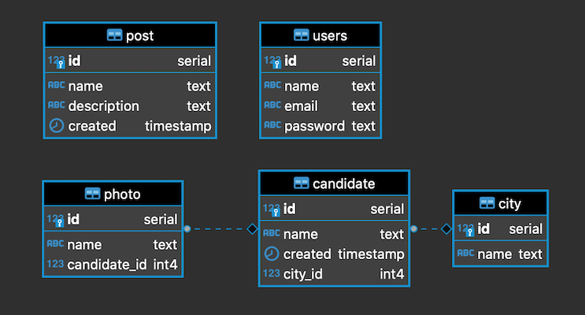
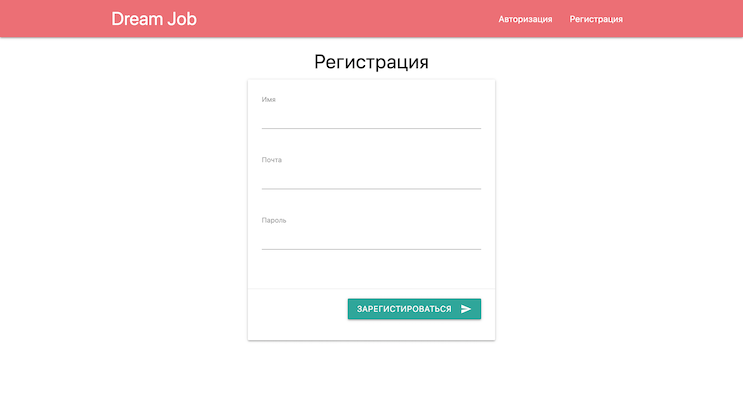
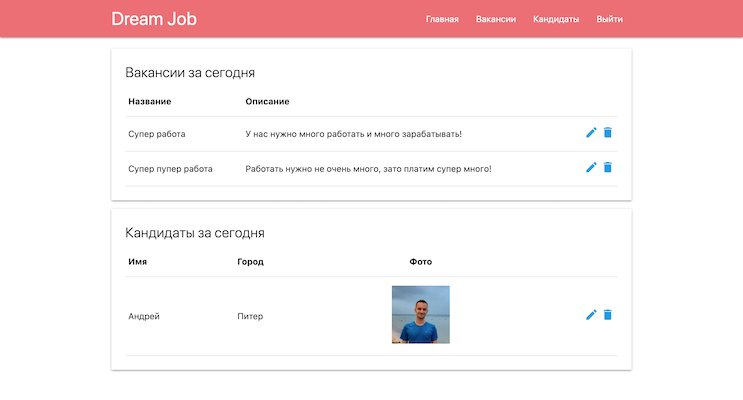
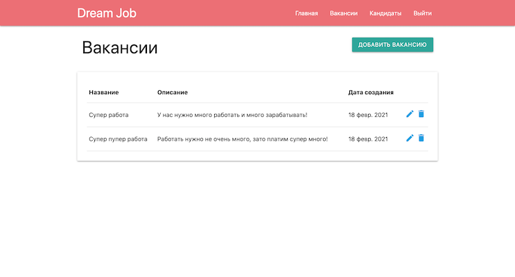
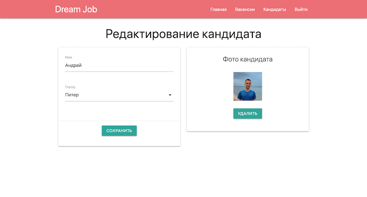

# Работа мечты
[](https://travis-ci.org/ReyBos/job4j_dreamjob) &nbsp;&nbsp;
[](https://codecov.io/gh/ReyBos/job4j_dreamjob)

<a name="menu"></a>
<ul>
    <li>
        <a href="#about">О проекте</a>
        <ul>
            <li><a href="#description">Описание</a></li>
            <li><a href="#technologies">Технологии</a></li>
            <li><a href="#structure">Структура</a></li>
            <li><a href="#scheme">Схема БД</a></li>
        </ul>
    </li>
    <li>
        <a href="#build">Сборка</a>
    </li>
    <li>
        <a href="#usage">Использование</a>
        <ul>
            <li><a href="#info">Общая информация</a></li>
            <li><a href="#reg_page">Регистрация/авторизация</a></li>
            <li><a href="#main_page">Главная</a></li>
            <li><a href="#post_page">Вакансии</a></li>
            <li><a href="#candidate_page">Кандидаты</a></li>
        </ul>
    </li>
    <li>
        <a href="#links">Полезные ссылки</a>
    </li>
    <li>
        <a href="#contact">Контакты</a>
    </li>
</ul>

<h2><a name="about">О проекте</a>&nbsp;&nbsp;<a href="#menu">&#9650;</a></h2>
<h4><a name="description">Описание</a>&nbsp;&nbsp;<a href="#menu">&#9650;</a></h4>
<p>
    Проект для изучения Java EE.
</p>
<p>
    Это приложение - биржа работы.<br>
    В системе будут два типа пользователей: кандидаты и менеджеры. Кандидаты будут публиковать резюме. Менеджеры будут публиковать вакансии о работе.<br>
    Кандидаты могут откликнуться на вакансию. Менеджер может пригласить на вакансию кандидата.
</p>
<h4><a name="technologies">Технологии</a>&nbsp;&nbsp;<a href="#menu">&#9650;</a></h4>
<ul>
    <li>Java 14</li>
    <li>Java EE Servlets, JSP, JSTL</li>
    <li>PostgreSQL, JDBC, Liquibase</li>
    <li>JUnit, Mockito, PowerMock</li>
    <li>Maven, Tomcat</li>
    <li>HTML, JavaScript, jQuery, JSON</li>
    <li><a href="https://materializecss.com">Material Design library</a></li>
</ul>
<h4><a name="structure">Структура</a>&nbsp;&nbsp;<a href="#menu">&#9650;</a></h4>
<pre><code>.
|-db
|---scripts
|-src
|---main
|-----java/ru/job4j/dream
|-------------filter
|-------------model
|-------------servlet
|-------------store
|-----resources
|-----webapp
|-------WEB-INF
|-------css
|-------js
|---test
|-----java/ru/job4j/dream
└─------------servlet</code></pre>

<h4><a name="scheme">Схема БД</a>&nbsp;&nbsp;<a href="#menu">&#9650;</a></h4>
<p align="center">
  
</p>

<h2><a name="build">Сборка</a>&nbsp;&nbsp;<a href="#menu">&#9650;</a></h2>
<ol>
    <li>
        Для успешной сборки и работы проекта на вашем компьютере должны быть установлены:
        <ol>
            <li>JDK 14(+)</li>
            <li>Maven</li>
            <li>PostgreSQL</li>
            <li>Tomcat</li>
        </ol>
    </li>
    <li>
        В PostgreSQL создайте базу с именем "dream_job"
    </li>
    <li>
        Скачайте проект к себе на компьютер с помощью команды<br>
        <code>git clone https://github.com/ReyBos/job4j_dreamjob.git</code><br>
        перейдите в корень проекта
    </li>
    <li>
        Добавьте настройки для доступа к базе данных, для этого внесите соответствующие изменения в файле 
        <code>src/main/resources/db.properties</code><br>
        и в файле конфигурации проекта <code>pom.xml</code>
    
``` 
<profile>   
    <id>production</id>
    <properties>
        <db.url>jdbc:postgresql://127.0.0.1:5432/dream_job</db.url>
        <db.username>postgres</db.username>
        <db.password>password</db.password>
        <db.driver>org.postgresql.Driver</db.driver>
    </properties>
</profile>
```
</li>
    <li>
        Выполните команду <code>mvn install -Pproduction</code> в корне проекта для его сборки<br>
        Будет выполнена миграция БД с помощью Liquibase.<br>
        В случае успешной сборки появится файл <code>target/job4j_dreamjob-1.0.war</code><br>
        переименуйте его в <code>dreamjob.war</code>
    </li>
    <li>
        Для запуска веб-приложения вам нужно скопировать <code>dreamjob.war</code> в папку <code>webapps</code> вашего Tomcat
    </li>
    <li>
        После запуска сервера приложение будет доступно по адресу<br>
        <a href="http://localhost:8080/dreamjob/">http://localhost:8080/dreamjob/</a>
    </li>
</ol>

<h2><a name="usage">Использование</a>&nbsp;&nbsp;<a href="#menu">&#9650;</a></h2>

<h3><a name="info">Общая информация</a>&nbsp;&nbsp;<a href="#menu">&#9650;</a></h3>
<p>
    Основной функционал приложения доступен зарегистрированным пользователям. Новым клиентам доступен раздел регистрации и авторизации. 
    Это достигается за счет фильтрации всех запросов в <code>ru.job4j.dream.filter.AuthFilter</code>. Сам фильтр (и все сервлеты) подключается
    к проекту в <code>src/main/webapp/WEB-INF/web.xml</code><br>
    Все операции сохранения/изменения/получения пользовательских данных описаны в интерфейсе <code>ru.job4j.dream.store.Store</code>
</p>

<h3><a name="reg_page">Регистрация/авторизация</a>&nbsp;&nbsp;<a href="#menu">&#9650;</a></h3>
<dl>
  <dt>Адреса</dt>
  <dd>
      <code>/reg.do</code> <code>/auth.do</code>
  </dd>

  <dt>Сервлеты</dt>
  <dd>
    <code>ru.job4j.dream.servlet.RegServlet</code> <code>ru.job4j.dream.servlet.AuthServlet</code>
  </dd>
  
  <dt>Модели</dt>
  <dd>
    <code>ru.job4j.dream.model.User</code>
  </dd>
</dl>
<p>
    Не авторизованному пользователю доступны только эти две страницы. 
</p>
<p align="center">
  
</p>

<h3><a name="main_page">Главная</a>&nbsp;&nbsp;<a href="#menu">&#9650;</a></h3>
<dl>
  <dt>Адреса</dt>
  <dd><code>/index.do</code></dd>

  <dt>Сервлеты</dt>
  <dd>
    <code>ru.job4j.dream.servlet.IndexServlet</code> <code>ru.job4j.dream.servlet.LogoutServlet</code>
  </dd>
  
  <dt>Модели</dt>
  <dd>
  </dd>
</dl>
<p>
    После успешной авторизации/регистрации пользователь попадает на главную страницу. Здесь отображаются свежие вакансии и новые кандидаты что были добавлены за текущий день. Для выхода из приложения нужно кликнуть на кнопку "выйти" в верхнем меню.
</p>
<p align="center">
  
</p>

<h3><a name="post_page">Вакансии</a>&nbsp;&nbsp;<a href="#menu">&#9650;</a></h3>
<dl>
  <dt>Адреса</dt>
  <dd><code>/post.do</code> <code>/post/edit.do</code></dd>

  <dt>Сервлеты</dt>
  <dd>
    <code>ru.job4j.dream.servlet.PostServlet</code> <code>ru.job4j.dream.servlet.PostEditServlet</code> <code>ru.job4j.dream.servlet.PostDeleteServlet</code>
  </dd>
  
  <dt>Модели</dt>
  <dd>
    <code>ru.job4j.dream.model.Post</code>
  </dd>
</dl>
<p>
    Пользователям доступна возможность добавлять/изменять/удалять вакансии. В вакансии возможно добавить заголовок и описание.
</p>
<p align="center">
  
</p>

<h3><a name="candidate_page">Кандидаты</a>&nbsp;&nbsp;<a href="#menu">&#9650;</a></h3>
<dl>
  <dt>Адреса</dt>
  <dd><code>/candidate.do</code> <code>/candidate/edit.do</code></dd>

  <dt>Сервлеты</dt>
  <dd>
    <code>ru.job4j.dream.servlet.CandidateServlet</code> <code>ru.job4j.dream.servlet.CandidateEditServlet</code> <code>ru.job4j.dream.servlet.CandidateDeleteServlet</code>
    <code>ru.job4j.dream.servlet.CandidatePhotoServlet</code> <code>ru.job4j.dream.servlet.CandidatePhotoDeleteServlet</code> <code>ru.job4j.dream.servlet.CityServlet</code>
  </dd>
  
  <dt>Модели</dt>
  <dd>
    <code>ru.job4j.dream.model.Candidate</code> <code>ru.job4j.dream.model.Photo</code> <code>ru.job4j.dream.model.City</code>
  </dd>
</dl>
<p>
    Пользователям доступна возможность добавлять/изменять/удалять кандидатов. У кандидата должно быть имя и город (что бы добавить город в список нужно создать новую миграцию, пример можно посмотреть в <code>db/scripts/update_006.sql</code>). После того как кандидат был создан, ему можно добавить одну фотографию. При удалении кандидата удаляется и его фотография. 
</p>
<p align="center">
  
</p>

<h2><a name="links">Полезные ссылки</a>&nbsp;&nbsp;<a href="#menu">&#9650;</a></h2>
<p>Ресурсы которые были полезны при создании проекта</p>
<ul>
    <li>
        <strong><a href="https://overcoder.net/q/5206/%D0%BA%D0%B0%D0%BA-%D0%B8%D1%81%D0%BF%D0%BE%D0%BB%D1%8C%D0%B7%D0%BE%D0%B2%D0%B0%D1%82%D1%8C-%D1%81%D0%B5%D1%80%D0%B2%D0%BB%D0%B5%D1%82%D1%8B-%D0%B8-ajax">link</a></strong>
        - сервлеты и Ajax
    </li>
    <li>
        <strong><a href="https://coderoad.ru/3455625/Linux-%D0%BA%D0%BE%D0%BC%D0%B0%D0%BD%D0%B4%D0%B0-%D0%B4%D0%BB%D1%8F-%D0%BF%D0%B5%D1%87%D0%B0%D1%82%D0%B8-%D1%81%D1%82%D1%80%D1%83%D0%BA%D1%82%D1%83%D1%80%D1%8B-%D0%BA%D0%B0%D1%82%D0%B0%D0%BB%D0%BE%D0%B3%D0%BE%D0%B2-%D0%B2-%D0%B2%D0%B8%D0%B4%D0%B5-%D0%B4%D0%B5%D1%80%D0%B5%D0%B2%D0%B0">link</a></strong>
        - вывод древовидной структуры папок в консоль
    </li>
    <li>
        <strong><a href="https://materializecss.com">link</a></strong>
        - готовый набор html элементов
    </li>
    <li>
        <strong><a href="https://medium.com/@fahimhossain_16989/installing-apache-tomcat-on-macos-mojave-using-homebrew-28ce039b4b2e">link</a></strong>
        - установка и запуск Tomcat на macOS
    </li>
    <li>
        <strong><a href="https://stackoverflow.com/questions/24623731/where-is-catalina-base-webapps-folder-for-tomcat-8-on-mac">link</a></strong>
        - расположение папки webapps (Tomcat)
    </li>
    <li>
        <strong><a href="https://sprosi.pro/questions/905924/zapusk-servera-tomcat-na-dvuh-raznyih-portah">link</a></strong>
        - запуск Tomcat на разных портах
    </li>
    <!--<li>
        <strong><a href="">link</a></strong>
        - сервлеты и Ajax
    </li>-->
</ul>

<h2><a name="contact">Контакты</a>&nbsp;&nbsp;<a href="#menu">&#9650;</a></h2>
<p>Связаться со мной по всем интересующим вопросам вы можете здесь:</p>

[](https://www.linkedin.com/in/reybos/)&nbsp;&nbsp;
[](https://vk.com/reybos)&nbsp;&nbsp;
[](https://www.instagram.com/andreybossiy)&nbsp;&nbsp;
[](https://t.me/reybos)&nbsp;&nbsp;
